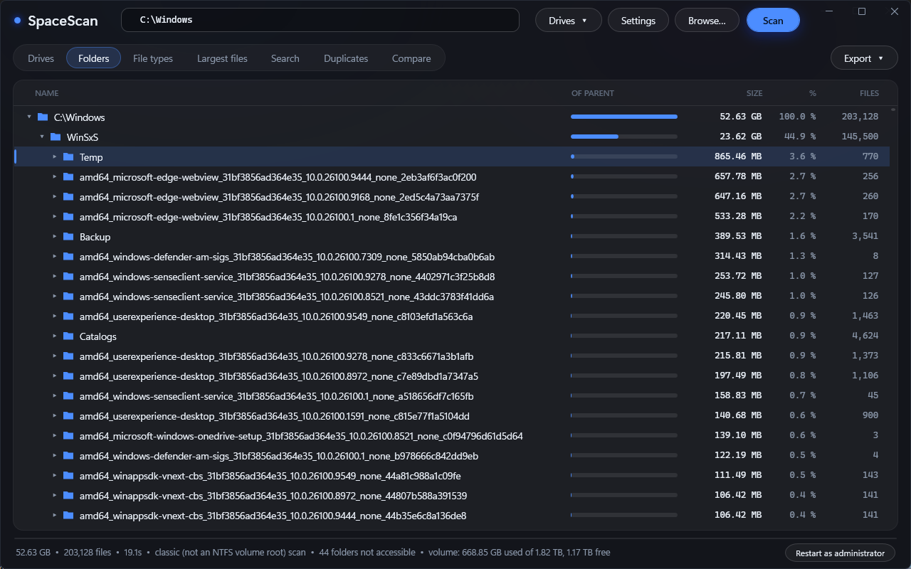

# SpaceScan

Finds what is filling up a Windows drive. Free, no limits, no nagging: it reads the NTFS Master File
Table directly, so a whole drive — including a 10 TB one — is mapped in seconds.



## What it does

- **Folder tree** with a size bar, percentage of the parent folder and the file count on every row.
- **Whole drives in seconds.** On an NTFS volume it reads the MFT (like the fast commercial tools).
  Anywhere else — a folder, a network share, a non-NTFS disk — it walks folders instead, with no
  path-length limit and without following junctions.
- **File types and categories:** where the space goes per extension, or grouped into Video, Photos,
  Archives, Installers and the rest.
- **Largest files** on the drive, and a **search** by name, minimum size and age that also runs off
  the MFT.
- **Duplicates:** same size, then the same hash of the first 64 KB, then of the whole file, with the
  space you would get back.
- **Compare** a scan with an earlier one and see what grew. Every scan is stored automatically.
- **Delete, copy or move** straight from the results, several items at once, through the Windows
  dialogs you already know.
- **Export** to HTML or CSV, and a **command line** for scheduled reports.
- **Exclusions** by name, extension or path, kept between runs.

## Command line

Runs without a window, for Task Scheduler and scripts:

```
SpaceScan.exe D:\ --report D:\report.html --compare-last
SpaceScan.exe C:\Users --csv users.csv --exclude "node_modules;*.iso"
SpaceScan.exe --help
```

Reading the MFT needs administrator rights; in Task Scheduler tick "Run with highest privileges".
Given just a path, SpaceScan opens its window and scans there — that is what the Explorer and File
Labs right-click entries use.

## Requirements

Windows 7 or later, including Windows Server. Nothing to install alongside it: the app is built
against the .NET Framework that ships with Windows.

## Building

```
build.cmd            compiles SpaceScan.exe
.\build.ps1          compiles, draws the icon and builds the installer (needs Inno Setup 6)
.\check.ps1          self-checks; run it elevated to cover the MFT paths too
```

## Licence

MIT — see [LICENSE](LICENSE).
